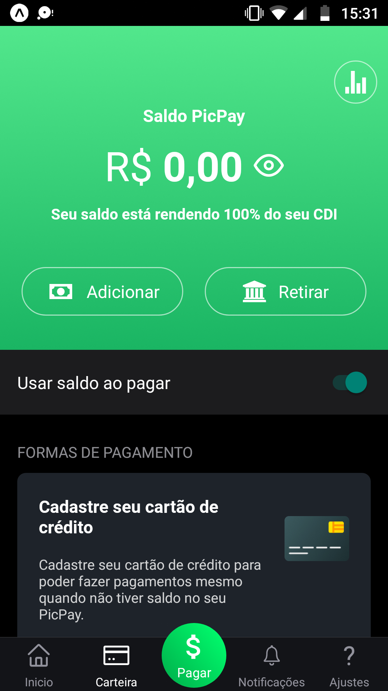

# PicPay - Nubank

<h3>:computer: Projeto</h3>

O objetivo desse projeto é recriar a interface do PicPay tendo como base o vídeo encontrado em: https://www.youtube.com/watch?v=0CraBZHejKI&list=PLPXWI3llyMiIfgu7p65MxdEKrplFbGbMg.

<h1 >
    
    
</h1>
</h1>

 

<h2><strong>:satellite: Tecnologias</strong></h2>
React-Native  
Expo  

<h2>:wrench: Sobre as Dependências:</h2>
yarn add react-native-gesture-handler  
yarn add react-native-iphone-x-helper  
yarn add react-native-qrcode  
yarn add react-native-vector-icons  
yarn add styled-components  
